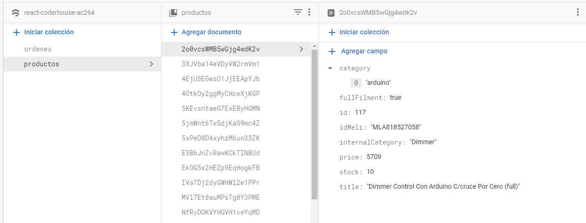
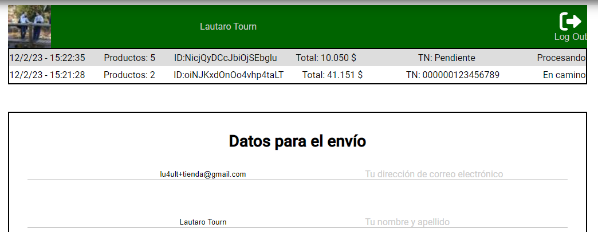
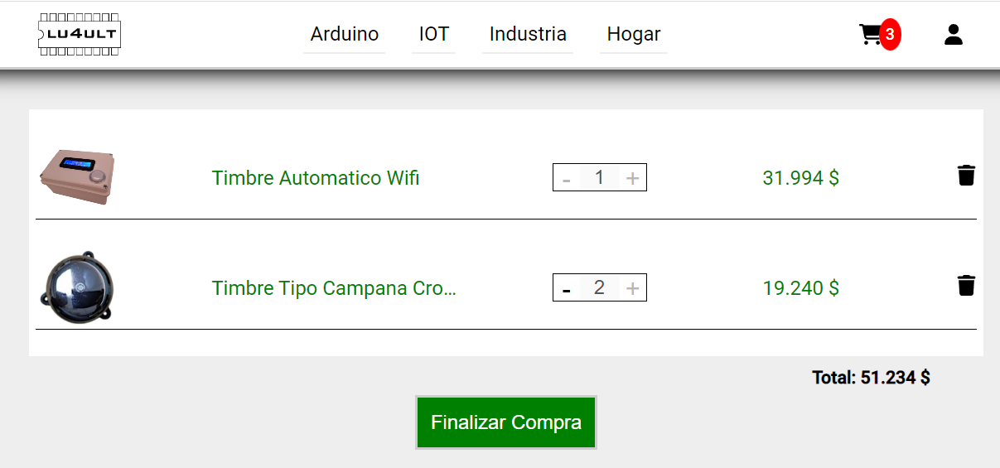
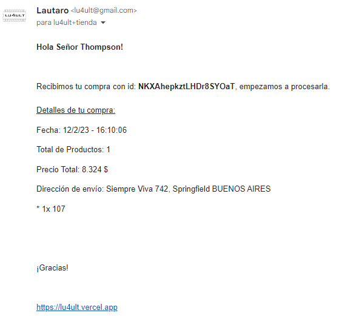
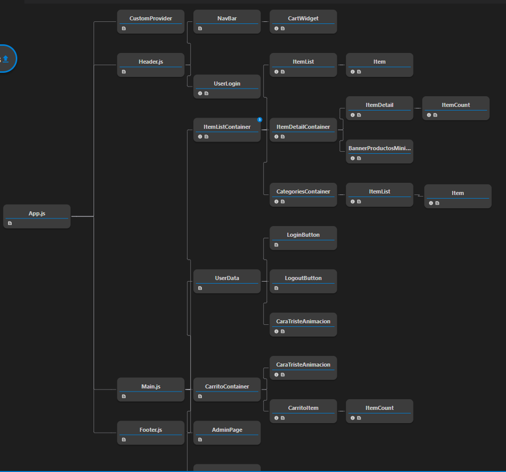

# Tienda eCommerce en React

### Ver Online:

https://lu4ult.vercel.app/

Este proyecto consiste en una tienda eCommerce desarrollada con React y firestore.
<strong>Importante</strong>
- Los productos están "linkeados" a productos reales en MercadoLibre a través del código MLA de cada publicación, consumiendo la api se obtienen datos directamente desde MercadoLibre que no se almacenan en firestore, como las urls de las imágenes o el precio.
- Para poder "finalizar la compra" es necesario iniciar sesión (servicio provisto por <a href="https://auth0.com/es">Auth0</a> ). También requiere de un email real para el envío de los datos de la compra (servicio provisto por <a href="https://www.emailjs.com/">EmailJS</a> )

### Ver Online:

https://lu4ult.vercel.app/

##### Instalación

- Clonar/Forkear el repositorio => Agradezco si me queres hacer un pull-request 😊
- npm install => ver listado dependencias a continuación
- npm start

docs_imgs

##### Dependencias:
(además de react lógicamente)
- auth0: login del usuario para que cargue sus datos postales
- emailjs: envío de confirmación de la compra
- Firebase
- md5: validación usuario y contraseña a través del hash
- notiflix: notificaciones y alertas
- react-responsive-carousel: carousel de imágenen en ItemDetail
- react-spinners: spinners mientras se cargan productos o cualquier otro fetch
- react-uuid: para los key de las listas en react
- sass

##### Alguna imágenes:

Consola Firestore

/user

/carrito

Email recibido al finalizar la compra

Árbol de componentes

